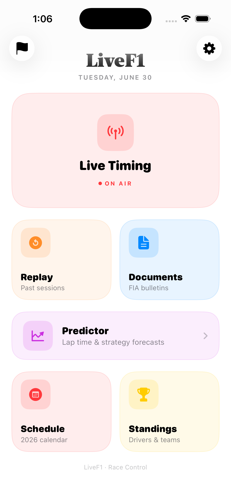
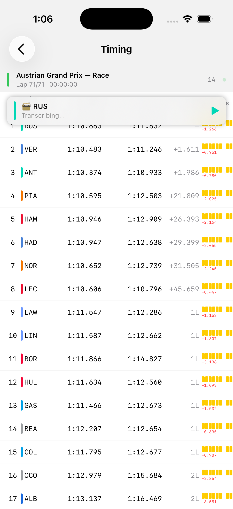
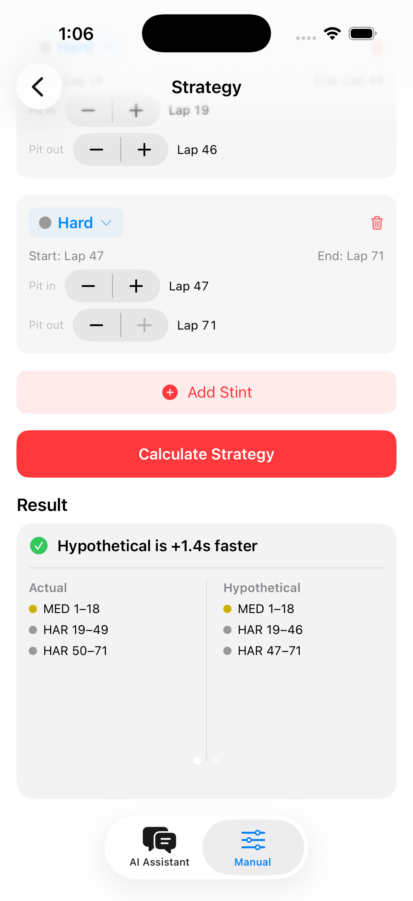
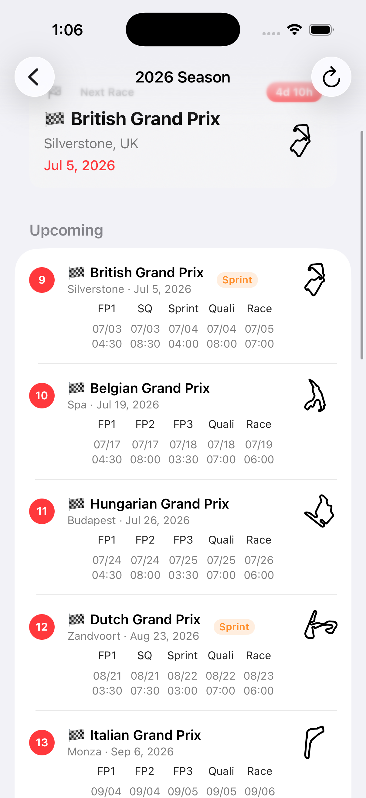
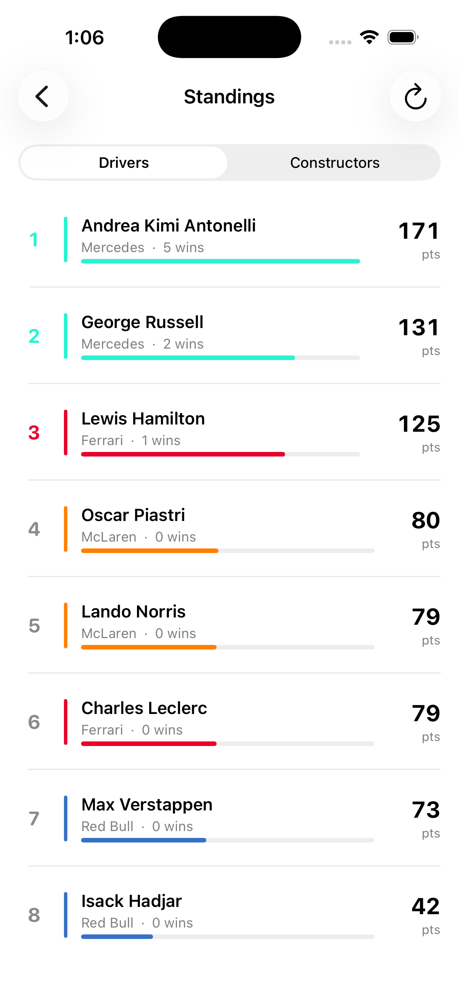
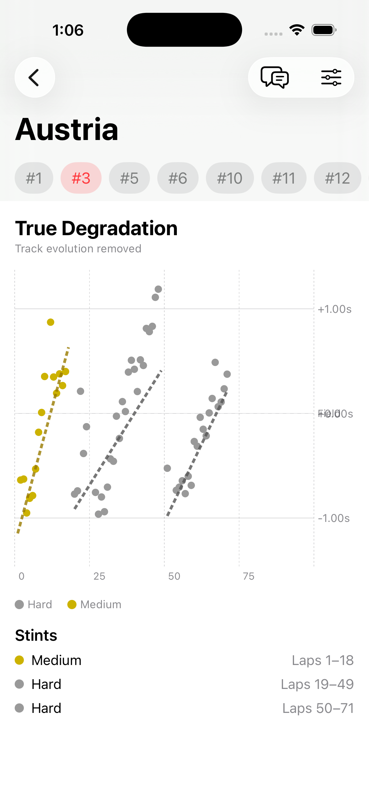
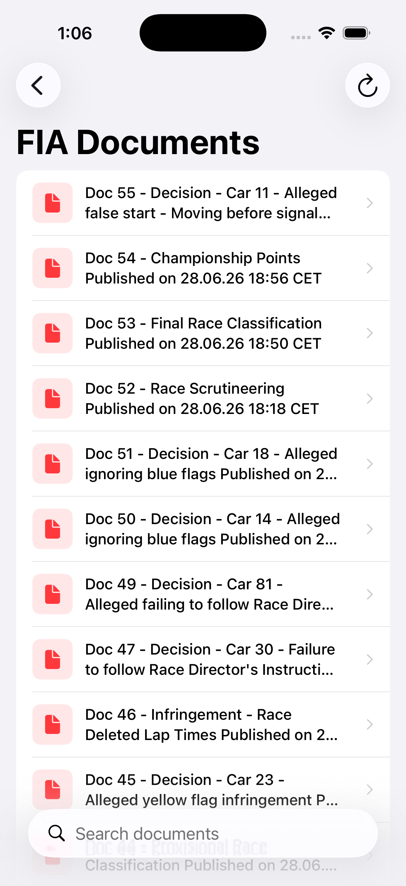
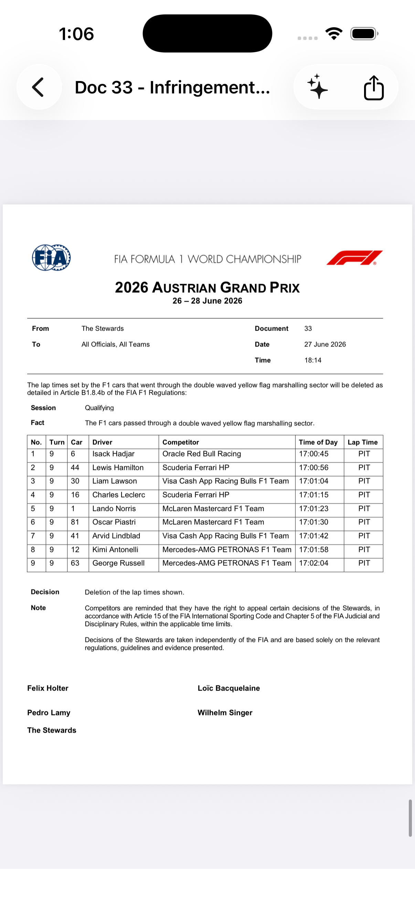

# LiveF1 🏎️

A native iOS app for real-time Formula 1 timing, championship data, race documentation, and on-device AI strategy analysis — built entirely in Swift with **zero third-party dependencies**.

LiveF1 connects directly to F1's official SignalR Core live timing stream (the same feed that powers professional tools like MultiViewer), tracks the full championship season, transcribes team radio on-device, summarizes FIA documents with Apple's on-device Foundation Models, and turns lap/stint data into a conversational race strategy assistant — all using nothing but Apple's own frameworks.

<p align="center">
  
  
  
</p>

## Features

- **Live Timing** — Real-time timing tower fed directly from F1's live WebSocket stream, with sub-second updates
- **Replay** — Browse and replay historical sessions from `.jsonStream` archives at configurable speed
- **Championship Schedule** — Full season calendar with session times converted to your local timezone, with per-track SVG layouts
- **Standings** — Driver and constructor standings with points visualizations
- **Team Radio** — On-device transcription of team radio clips, no audio ever leaves the phone
- **FIA Documents** — Official race bulletins, fetched live and summarized on-device with Apple's Foundation Models
- **Strategy Assistant** — A conversational chatbot, grounded in real lap and stint data, that explains and compares hypothetical race strategies

## Why this project

Most "F1 app" projects wrap a REST API. This one doesn't have that luxury for most of its core features — F1's live timing protocol is an undocumented binary SignalR Core stream, the FIA's document portal is a JS-rendered page with no public API, and there's no off-the-shelf way to turn raw lap data into strategy advice. Building LiveF1 meant reverse-engineering the data pipelines from network traffic and wiring up on-device AI for the rest, using only first-party Apple tooling: `URLSessionWebSocketTask`, `Compression`, `WKWebView`, `Speech`, `FoundationModels`, and `Security`.

## Technical highlights

**Real-time WebSocket data pipeline**
- Connects to F1's SignalR Core endpoint and handles the full negotiation, handshake, and subscription flow
- Processes binary-framed delta messages (record-separator delimited) at ~10 updates/second during a live session
- Deep-merges partial state patches into full session state, handling both array- and dict-shaped deltas
- Decompresses zlib-encoded telemetry topics (`CarData.z`, `Position.z`) using Apple's `Compression` framework

**On-device generative AI with Foundation Models**
- FIA document summaries are generated entirely on-device with Apple's `FoundationModels` framework — no document text or summary ever leaves the phone
- The Strategy Assistant chatbot is grounded in actual session data: `StrategyContextBuilder` assembles lap, stint, and degradation data into model context, and `StrategyTranslator` turns model output back into structured strategy comparisons the UI can render
- Both features degrade gracefully on devices without Apple Intelligence support, falling back to the raw document list / manual strategy view

**Headless-browser data extraction (FIA Documents)**
- No public FIA API exists, so a hidden, off-screen `WKWebView` loads the live document portal and polls it for content
- Injected JavaScript walks the DOM to extract document title, category, publish date, and PDF link for every result, falling back gracefully through `aria-label` → visible text → filename when structured titles aren't present
- Handles the portal's redirect-to-current-season behavior, then paginates by rewriting the resolved URL's `page` query parameter
- Detects "stuck" pagination (the site re-serving the same page past the last valid one) by diffing extracted link counts between pages, with a re-check tick to avoid false positives from slow renders
- Wrapped in `async/await` via `withCheckedContinuation`, with a polling loop, per-page timeout, and graceful partial-results fallback if the page hangs

**Swift concurrency throughout**
- `async/await` for all network operations, including the JS-bridge calls into `WKWebView` and Foundation Models generation
- `@MainActor` session and document stores keep UI updates pinned to the main thread
- Sequential transcription queue using `withCheckedContinuation` to respect Apple Speech's concurrency limits
- `withTaskGroup` for concurrent replay stream fetching

**Authentication**
- F1TV login via `WKWebView` with cookie extraction — credentials never leave F1's servers or touch app code
- JWT stored in iOS Keychain via the `Security` framework
- Graceful degradation: basic timing works with no auth, telemetry unlocks with an F1TV subscription

**On-device ML**
- Team radio MP3s are downloaded and transcribed locally with `SFSpeechRecognizer`
- No audio, document text, or strategy context is ever sent to a third-party service

## Architecture

### Live timing — `LiveTiming/`
- `F1TimingClient` — SignalR Core negotiation, WebSocket frame parsing, zlib decompression
- `F1SessionStore` (`@MainActor`) — deep-merges deltas into session state, queues radio transcription, publishes `[Driver]`
- `F1TimingParser` — pure function: raw payload → typed `[Driver]`, no side effects
- `F1DataSource` protocol — lets live (`F1TimingClient`) and replay (`F1ReplayClient`) clients swap in transparently without touching the store or views
- `TokenStore` — Keychain-backed JWT storage

### Championship data — `ChampionshipInfo/`
- `ChampionshipDataStore` — `ObservableObject` that fetches and caches schedule/standings data
- Sourced from the [Jolpi Ergast API](https://api.jolpi.ca/ergast/f1); responses cached in `UserDefaults` with a 1-hour TTL
- `ChampionshipModels` — race, session, driver/constructor standing, and cache-entry models
- `F1DBTrackSVGs/` — per-circuit SVG track layouts rendered in `ChampionshipTrackView`

### FIA Documents — `FiaDocuments/`
- `FIADocumentFetcher` — drives a hidden `WKWebView` through the FIA document portal, polls for rendered PDF links, injects an extraction script, and paginates until no new documents appear
- `FIADocumentStore` — owns fetched documents and routes them through Foundation Models for on-device summarization
- `FIADocumentsView` — document list with AI summaries, screenshots below

### Race Strategy / Lap Forecaster — `LapForecaster/`
- `F1LapParser` / `F1PredictorStintParser` / `F1PredictorSessionParser` — turn raw session data into typed lap, stint, and session models
- `DegradationModel` / `TrackEvolutionCalculator` — model tyre degradation and track evolution over a run
- `StrategyCalculator` — generates hypothetical strategies (stop counts, compounds, windows) from the above models
- `Chatbot/` — `StrategyContextBuilder` packages live strategy data as model context, `StrategyAssistantView` is the conversational UI, `StrategyTranslator` maps model output back into structured, renderable strategy comparisons; `ManualStrategyView` is the non-AI fallback
- `ViewModels/` — `RaceViewModel`, `SessionPickerViewModel` drive `RaceDetailView` and `SessionPickerView`

### Views — `Views/` and per-feature `Views/` folders
- `HomeView` — dashboard with navigation to all features
- `TimingTowerDetails` / `DriverDetails` — live timing tower and per-driver telemetry
- `RadioDetails` — toast notifications + transcribed radio list
- `Menus` — `F1LoginWebView`, `LiveConnectView`, `ReplayPickerView`
- `DebugTabView`, `SettingsView`, `CreditsView`

## Screenshots

| Home | Live Timing | Schedule |
|---|---|---|
|  |  |  |

| Driver Standings | Stint Details | Hypothetical Strategy |
|---|---|---|
|  |  |  |

| FIA Document List | FIA Document Summary |
|---|---|
|  |  |

## How the live timing pipeline works

```
F1 SignalR Server
       │  WebSocket frames (record-separator delimited)
       ▼
F1TimingClient
  • Negotiates connection ID via HTTP POST
  • Opens WebSocket with Bearer auth
  • Parses SignalR frame types (1=data, 3=snapshot, 6=ping)
  • Decompresses .z topics (base64 → zlib → JSON)
       │
       ▼
F1SessionStore (@MainActor)
  • Deep-merges delta into rawTopics[topic]
  • Handles array/dict index merging for sector updates
  • Publishes drivers: [Driver] on every update
       │
       ▼
F1TimingParser (pure function)
  • Reads TimingData, DriverList, TimingStats, TimingAppData
  • Produces sorted [Driver] with positions, gaps, sectors, tyres
       │
       ▼
SwiftUI Views — re-render on @Published changes
```

## How the FIA document pipeline works

```
Hidden WKWebView
  • Loads FIA season document portal (redirects to current season)
  • Polls every 1s for rendered PDF link count, up to a 30s timeout
       │
       ▼
Injected extraction script
  • Walks DOM for every <a href> containing ".pdf"
  • Resolves title (aria-label → text → filename fallback)
  • Walks ancestor nodes for category + date metadata
       │
       ▼
FIADocumentFetcher
  • Decodes JSON payload into [FIADocument]
  • Dedupes by relative URL path
  • Rewrites ?page= and reloads until no new docs / content repeats
       │
       ▼
FIADocumentStore
  • Sorts dated documents
  • Sends document text to FoundationModels (on-device) for summarization
       │
       ▼
FIADocumentsView — document list + on-device AI summary
```

## How the Strategy Assistant works

```
Session lap / stint data
       │
       ▼
F1LapParser, F1PredictorStintParser, F1PredictorSessionParser
  • Raw timing payload → typed laps, stints, sessions
       │
       ▼
DegradationModel + TrackEvolutionCalculator
  • Model tyre falloff and track grip evolution over a run
       │
       ▼
StrategyCalculator
  • Produces candidate strategies (stops, compounds, windows)
       │
       ▼
StrategyContextBuilder
  • Packages strategies + live data as grounded context
       │
       ▼
FoundationModels (on-device)
  • Generates natural-language strategy explanation/comparison
       │
       ▼
StrategyTranslator → StrategyAssistantView
  • Maps model output back to structured, renderable comparisons
```

## Project structure

```
LiveF1/
├── ChampionshipInfo/
│   ├── ChampionshipDataStore.swift
│   ├── ChampionshipModels.swift
│   ├── ChampionshipScheduleView.swift
│   ├── ChampionshipStandingsView.swift
│   ├── ChampionshipTrackView.swift
│   └── F1DBTrackSVGs/             # Per-circuit SVG track layouts
├── FiaDocuments/
│   ├── FIADocumentFetcher.swift   # Headless WKWebView scraper
│   ├── FIADocumentStore.swift     # State + Foundation Models summarization
│   └── FIADocumentsView.swift
├── LapForecaster/
│   ├── Chatbot/
│   │   ├── ManualStrategyView.swift
│   │   ├── StrategyAssistantView.swift
│   │   ├── StrategyContextBuilder.swift
│   │   └── StrategyTranslator.swift
│   ├── Degradation/
│   │   ├── DegradationModel.swift
│   │   └── TrackEvolutionCalculator.swift
│   ├── Laps/
│   │   ├── F1LapModels.swift
│   │   └── F1LapParser.swift
│   ├── Sessions/
│   │   ├── F1PredictorSession.swift
│   │   └── F1PredictorSessionParser.swift
│   ├── Stints/
│   │   ├── F1PredictorStint.swift
│   │   └── F1PredictorStintParser.swift
│   ├── StrategyCalculator.swift
│   ├── ViewModels/
│   │   ├── RaceViewModel.swift
│   │   └── SessionPickerViewModel.swift
│   └── Views/
│       ├── LapTimeChartView.swift
│       ├── RaceDetailView.swift
│       └── SessionPickerView.swift
├── LiveTiming/
│   ├── DataClients/
│   │   ├── F1ReplayClient.swift
│   │   └── F1TimingClient.swift
│   ├── DataStores/
│   │   ├── F1SessionStore.swift
│   │   ├── F1TimingParser.swift
│   │   └── TokenStore.swift
│   ├── Models/
│   │   ├── CarTelemetry.swift
│   │   ├── ColorHelper.swift
│   │   ├── Driver.swift
│   │   ├── F1DataSource.swift
│   │   └── RadioMessage.swift
│   └── Views/
│       ├── DriverDetails/
│       ├── Menus/
│       ├── RadioDetails/
│       └── TimingTowerDetails/
├── Examples/                      # Screenshots used in this README
└── Views/
    ├── ContentView.swift
    ├── CreditsView.swift
    ├── DebugTabView.swift
    ├── HomeView.swift
    └── SettingsView.swift
```

## Setup

1. Clone the repo and open `LiveF1.xcodeproj` in Xcode
2. Set your development team
3. Build to a real device — live timing's WebSocket needs network access beyond simulator limits
4. Use **Replay** mode to try it with historical data, no login needed
5. Use **Live** mode during an active F1 session for real-time data

## Requirements

- iOS 26+
- Xcode 17+
- Swift 6
- An Apple Intelligence-compatible device for on-device FIA summaries and the Strategy Assistant chatbot (both features fall back to non-AI views otherwise)

No API keys, no third-party SDKs, no CocoaPods or SPM dependencies.

## Data sources

- Live timing: F1's official SignalR Core stream (reverse-engineered, undocumented)
- Championship schedule & standings: [Jolpi Ergast Mirror](https://api.jolpi.ca/ergast/f1) — `current` resolves automatically to the active season, so no yearly code changes are needed
- FIA documents: live-scraped from the official FIA document portal via headless `WKWebView`
- Strategy data: derived entirely from session lap/stint data already pulled by the live timing and replay clients

## Caching

Championship API responses are cached locally for 1 hour. Pull to refresh forces a network fetch and updates the cache. Cache lives in `UserDefaults` and can be cleared via `ChampionshipDataStore.clearCache()`.

## What I learned building this

- Reverse-engineering an undocumented SignalR Core protocol from raw network traffic
- Handling F1's inconsistent delta merge format, where the same logical data shows up as an array in one update and a dict in the next
- Driving a hidden `WKWebView` as a structured data source — polling for render completion, injecting extraction scripts, and detecting pagination dead-ends without a real API to lean on
- Grounding Foundation Models output in real session data so summaries and strategy advice stay factual instead of hallucinating lap times or compound choices
- Managing Apple Speech's concurrency constraints with a sequential task queue
- The practical tradeoffs of a fat store vs. strict MVVM for real-time streaming data in SwiftUI

### License

```
MIT License

Copyright (c) 2026 R. Koo

Permission is hereby granted, free of charge, to any person obtaining a copy
of this software and associated documentation files (the "Software"), to deal
in the Software without restriction, including without limitation the rights
to use, copy, modify, merge, publish, distribute, sublicense, and/or sell
copies of the Software, and to permit persons to whom the Software is
furnished to do so, subject to the following conditions:

The above copyright notice and this permission notice shall be included in all
copies or substantial portions of the Software.

THE SOFTWARE IS PROVIDED "AS IS", WITHOUT WARRANTY OF ANY KIND, EXPRESS OR
IMPLIED, INCLUDING BUT NOT LIMITED TO THE WARRANTIES OF MERCHANTABILITY,
FITNESS FOR A PARTICULAR PURPOSE AND NONINFRINGEMENT. IN NO EVENT SHALL THE
AUTHORS OR COPYRIGHT HOLDERS BE LIABLE FOR ANY CLAIM, DAMAGES OR OTHER
LIABILITY, WHETHER IN AN ACTION OF CONTRACT, TORT OR OTHERWISE, ARISING FROM,
OUT OF OR IN CONNECTION WITH THE SOFTWARE OR THE USE OR OTHER DEALINGS IN THE
SOFTWARE.
```
