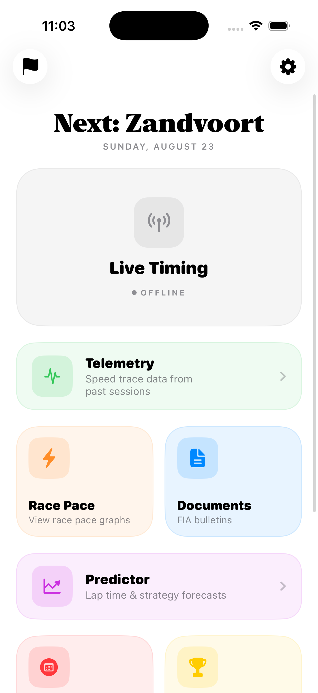
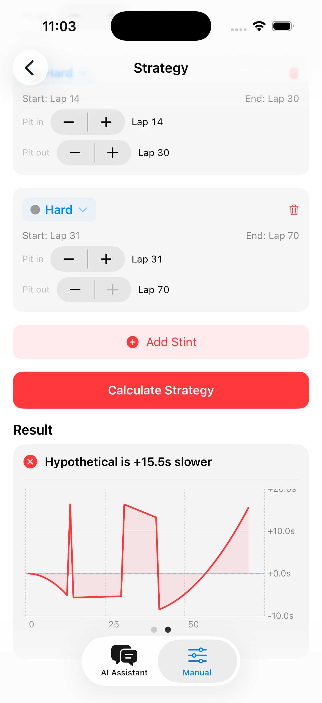
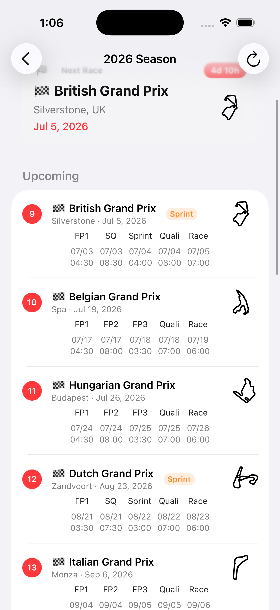
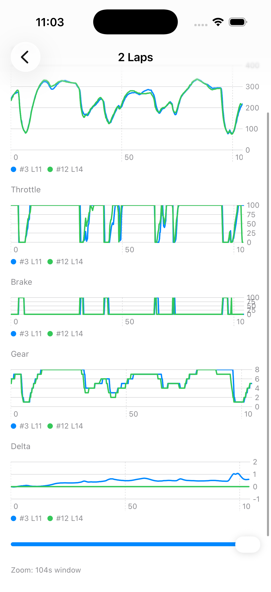
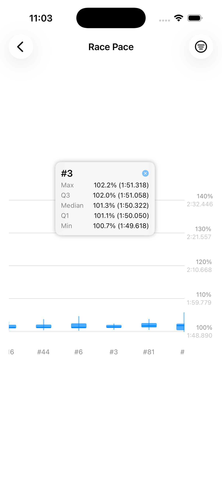
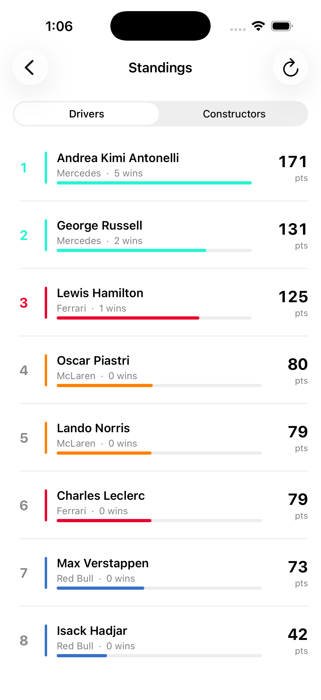
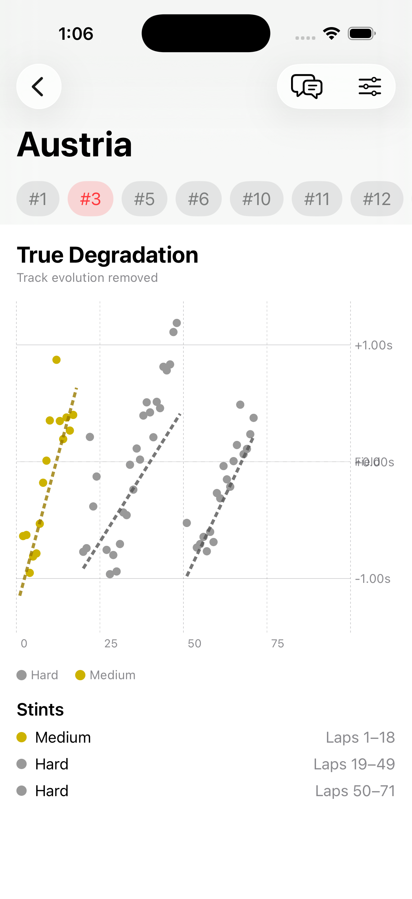
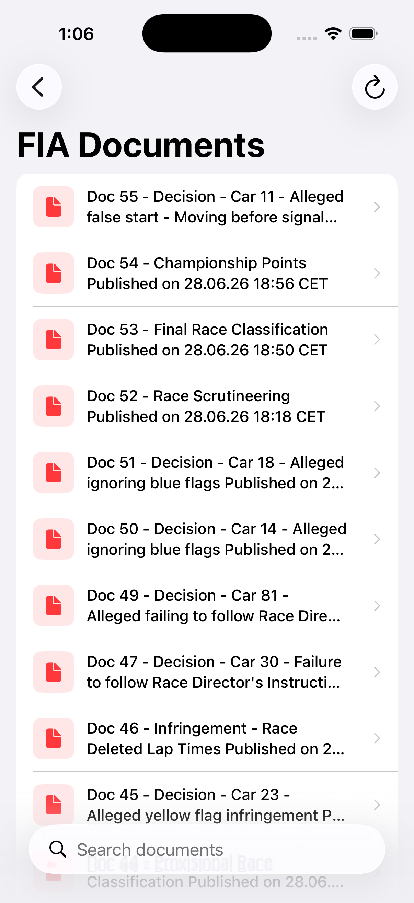
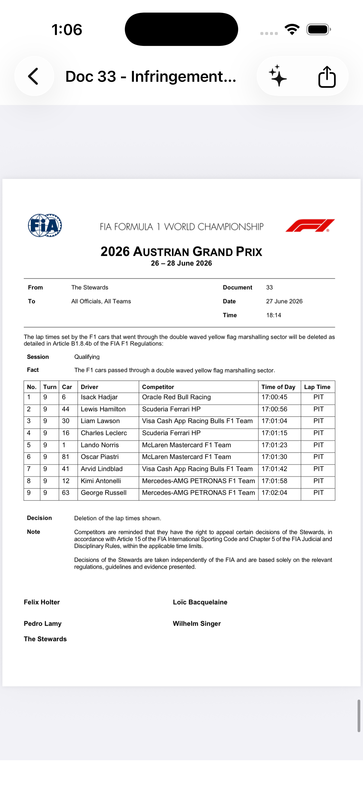

# Redline - Formula Telemetry & Live Timing 🏎️

A native iOS app for real-time Formula 1 timing, telemetry analysis, race strategy prediction, and race documentation — built entirely in Swift, running almost every intelligence feature **on-device** with Apple's own frameworks.

**TestFlight:** https://testflight.apple.com/join/gW1asZnR

<p align="center">
  
  
  
</p>

## Why I built this

I've been a race fan since I was a kid and, at the track, there's no clean way to follow live timing on your phone. Off the track, most F1 apps bury the data behind logins, ads, and unnecessary complexity just to check a lap time or read a stewards' bulletin. LiveF1 is my attempt at the app I actually wanted: fast, simple, and focused — live timing, telemetry, and race intelligence in one place, with no backend of my own and no account required to use the core features.

There's no server behind this app. Every screen is powered by a direct API/WebSocket connection or by on-device computation — no database, no backend infrastructure to maintain.

## Features

### Live Timing
- Real-time timing tower, driver tracker, race control feed, and team radio log, streamed directly from Formula 1's official SignalR Core live timing WebSocket
- Optional F1TV login through an embedded `WKWebView` — the login flow happens entirely on F1's own pages, and the app only extracts the resulting auth token to unlock live car telemetry over the WebSocket. Credentials never touch app code.
- Team radio clips are transcribed **on-device** with WhisperKit — no audio leaves the phone
- **Replay** mode lets you browse and replay past sessions with historical data, no login needed

### Telemetry & Race Pace
- Past-lap telemetry comparison via the OpenF1 API — speed, brake, throttle, and gear traces for any two laps, with a running delta plotted across the lap
- Race pace box-and-whisker plots per driver/stint, also from OpenF1, for at-a-glance pace and consistency comparisons

### Strategy Predictor
- A what-if strategy predictor that models tyre degradation, track evolution, compound choice, and tyre age against session pace to generate candidate strategies from OpenF1 data
- A conversational chatbot built on Apple's on-device **Foundation Models** framework lets you ask about and compare those strategies in natural language — the model explains and narrates, but every number it references comes from the underlying degradation/pace algorithm, not from the LLM itself, so it stays grounded instead of hallucinating lap times or compounds
- Example supported queries: *"Would a 3 stop have been faster?"*, *"What if Max pitted 5 laps earlier?"*, *"Show me an aggressive undercut strategy"*, *"What if we used softs at the end?"*
- `StrategyAssistantView` renders results as inline strategy comparison cards showing actual vs. hypothetical stint sequences and predicted time delta

**Degradation modelling** (`DegradationModel` / `DegradationModelFactory`) uses a two-pass outlier-filtering approach:
1. Hard filter — removes pit-out laps and laps more than 7% above the stint median, and skips the first 2 warm-up laps of each stint
2. Initial linear regression fit
3. Soft filter — removes laps more than 2 standard deviations from the initial fit
4. Final regression refit on clean data

The `DegradationModel` protocol is designed for extensibility — the current `LinearDegradationModel` can be swapped for polynomial or exponential implementations without changing downstream code.

**Track evolution** (`TrackEvolutionCalculator`) separates track-wide grip improvement from tyre-specific degradation:
1. Computes each driver's median clean lap time for the session
2. Expresses every lap as a delta from that driver's median, normalising out compound pace differences
3. Takes the per-lap-number median delta across all drivers (minimum 3 drivers per lap for statistical validity)
4. Fits a linear regression through the median deltas to produce a smooth track evolution curve

This curve is subtracted from each driver's lap times to produce an adjusted degradation signal that reflects true tyre wear independent of improving track conditions — particularly important at street circuits like Monaco and Canada where track evolution dominates raw lap time trends.

**Strategy simulation** (`RaceViewModel.calculateTimeDelta`) calculates the predicted time delta between the actual strategy and a hypothetical alternative: actual total time is summed from real lap data, hypothetical time is predicted lap-by-lap using the degradation model per compound (with track evolution added back for absolute estimates), and a fixed pit stop delta of **22 seconds** is applied per stop.

`LapTimeChartView` is a two-page swipeable chart: page 1 shows absolute lap times with per-stint regression overlays coloured by compound; page 2 shows the track-evolution-adjusted delta view with a flat zero reference line representing field pace, exposing true degradation slopes.

### FIA Documents
- Official FIA race documents and bulletins, scraped live from the FIA's document portal (which has no public API) via a hidden, off-screen `WKWebView`
- Summarized entirely **on-device** with Foundation Models — document text and summaries never leave the phone
- Both AI features degrade gracefully to a plain document list / manual strategy view on devices without Apple Intelligence

### Championship & Race Story
- Full schedule, results, and driver/constructor standings from the Ergast/Jolpica API, with `current` auto-resolving to the active season so the app works year to year without changes
- A "Race Story" chart plotting every driver's position by lap across a race
- Per-circuit SVG track layouts (credited below)
- Driver and constructor points visualized with points bars in the standings view
- Championship responses are cached client-side in `UserDefaults` with a 1-hour TTL; pull-to-refresh forces a network fetch and updates the cache (cache can be cleared programmatically via `ChampionshipDataStore.clearCache()`)

### Weather
- Track-level weather forecasts for the upcoming race weekend via **WeatherKit**

### Widgets
- Home Screen and Lock Screen widgets (WidgetKit) showing the countdown to the next session, backed by a shared App Group cache — the widget extension never makes its own network calls

## Built with Apple-first tooling

This app leans deliberately on first-party Apple frameworks rather than reaching for third-party SDKs:

| Purpose | Framework |
|---|---|
| Live WebSocket connection to F1's timing feed | `URLSessionWebSocketTask` |
| Telemetry decompression (`CarData.z`, `Position.z`) | `Compression` |
| F1TV login + FIA document scraping | `WKWebView` |
| On-device document summarization & strategy chat | `FoundationModels` (Apple Intelligence) |
| On-device team radio transcription | WhisperKit (on-device Whisper, the one third-party dependency in the project) |
| Auth token storage | `Security` (Keychain) |
| Track weather forecasts | `WeatherKit` |
| Charts (telemetry traces, pace plots, race story, lap time / delta views) | Swift Charts |
| Home/Lock Screen widgets | `WidgetKit` |
| Championship data caching | `UserDefaults` (1-hour TTL) |
| Concurrency throughout | Swift Concurrency (`async/await`, `@MainActor`, `withTaskGroup`) |

No backend server, no database — every feature is either a direct API/WebSocket call, a cached API response, or an on-device computation.

## Technical highlights

**Real-time WebSocket data pipeline**
- Negotiates and connects to F1's SignalR Core endpoint, handling the full negotiation, handshake, and subscription flow
- Parses binary-framed, record-separator-delimited delta messages at ~10 updates/second during a live session
- Deep-merges partial state patches into full session state, handling both array- and dict-shaped deltas — F1's feed inconsistently represents the same logical data as either, depending on the update
- Decompresses zlib-encoded telemetry topics (`CarData.z`, `Position.z`) with the `Compression` framework

**On-device generative AI, grounded in real data**
- FIA document summaries and the Strategy Assistant chatbot both run entirely on-device via `FoundationModels` — nothing is sent to a third-party inference service
- `StrategyContextBuilder` packages lap, stint, and degradation data as structured natural-language model context — including the selected driver's actual stint sequence and pit laps, all other drivers' strategies for the race, and aggregated strategy templates grouped by stop count with average pit-lap windows and most common compound sequences
- `StrategyTranslator` uses a `@Generable` structured output schema to translate natural-language strategy requests into typed `[F1PredictorStint]` arrays — the model performs no calculations, it only resolves intent into structured stint data passed to the simulation layer
- Underlying strategy math (degradation curves, track evolution, compound/pace tradeoffs) is computed algorithmically — Foundation Models narrates and compares, it doesn't invent the numbers

**Headless-browser data extraction (FIA Documents)**
- No public FIA API exists, so a hidden, off-screen `WKWebView` loads the live document portal and polls it for rendered content
- Injected JavaScript walks the DOM to extract title, category, date, and PDF link per document, falling back through `aria-label` → visible text → filename when structured titles aren't present
- Handles the portal's redirect-to-current-season behavior, then paginates by rewriting the resolved URL's `page` parameter, detecting "stuck" pagination by diffing link counts between pages
- Wrapped in `async/await` via `withCheckedContinuation`, with a polling loop, per-page timeout, and graceful partial-results fallback

**Authentication**
- F1TV login happens inside `WKWebView`; the app extracts only the resulting cookie/token, never handling credentials directly
- JWT stored in the iOS Keychain via `Security`
- Graceful degradation: basic timing works with no auth at all; telemetry unlocks with an F1TV subscription

**Swift concurrency throughout**
- `async/await` for all networking, including JS-bridge calls into `WKWebView` and Foundation Models generation
- `@MainActor` session and document stores keep UI updates pinned to the main thread
- Sequential transcription queue to respect on-device Whisper's concurrency limits
- `withTaskGroup` for concurrent replay stream fetching

## Architecture

**Navigation**
- Centralized router pattern instead of inline `NavigationLink`s
- A single `Destination` enum (`Hashable`) defines every screen as a case, with associated values carrying the data each one needs
- An `@Observable` `Router` owns the navigation path and exposes `push`, `pop`, and `popToRoot`
- One `NavigationStack` per independent context (main flow, plus any sheet needing its own push/pop history), each with a single `.navigationDestination(for:)` mapping `Destination` → view
- Enables `popToRoot()` from deep stacks, navigation triggered from closures/deep links/completion handlers, and lazy view construction (destinations only built on push)

```
LiveF1/
├── ChampionshipInfo/        # Schedule, standings, race story, per-circuit SVGs, UserDefaults cache
├── FiaDocuments/            # Headless WKWebView scraper + Foundation Models summarization
├── LapForecaster/           # Strategy predictor, degradation model, chatbot
│   └── Chatbot/             # FoundationModels-grounded strategy assistant
├── LiveTiming/              # SignalR client, session store, timing tower, radio, race control
├── StaticTelemetry/         # OpenF1-backed lap comparison + race pace plots
├── WeatherData/             # WeatherKit track forecasts
└── Views/                   # Top-level navigation, settings, credits

LiveF1Widget/                # WidgetKit extension (Home Screen + Lock Screen)
```

### Live timing pipeline
```
F1 SignalR Server
   │ WebSocket frames (record-separator delimited)
   ▼
F1TimingClient        — negotiation, WebSocket, frame parsing, zlib decompression
   ▼
F1SessionStore (@MainActor) — deep-merges deltas, queues radio transcription
   ▼
F1TimingParser (pure function) — raw payload → typed [Driver]
   ▼
SwiftUI Views — re-render on @Published changes
```

### FIA document pipeline
```
Hidden WKWebView → injected extraction script → FIADocumentFetcher
   (loads portal, polls,        (walks DOM for       (dedupes, paginates
    handles redirect)            PDF links + meta)     until no new docs)
   ▼
FIADocumentStore — sorts, sends text to on-device FoundationModels
   ▼
FIADocumentsView — document list + on-device AI summary
```

### Strategy predictor pipeline
```
OpenF1 lap/stint data (F1LapParser, F1PredictorStintParser, F1PredictorSessionParser)
   ▼
DegradationModel + TrackEvolutionCalculator — tyre falloff, track grip evolution
   ▼
StrategyCalculator / RaceViewModel.calculateTimeDelta — candidate strategies (stops, compounds, windows)
   ▼
StrategyContextBuilder → FoundationModels (on-device) → StrategyTranslator
   ▼
StrategyAssistantView — conversational, grounded strategy comparison
```

### Data layer models (Strategy Predictor)
- `F1Lap` — single lap record including sector times, speeds, and segment colour data from OpenF1
- `F1PredictorStint` — tyre stint record with compound, lap range, and tyre age at start
- `F1PredictorSession` — race session metadata including circuit, country, and scheduled times
- `AnnotatedLap` — derived type joining a lap with its stint's compound and tyre age
- `SessionPickerViewModel` — fetches and holds the race calendar, filtered to completed and upcoming Race sessions
- `RaceViewModel` — coordinates parallel fetching of laps and stints for a selected session; owns all derived state (annotated laps, regression models, track evolution, hypothetical strategy results)

All parsers (`F1LapParser`, `F1PredictorStintParser`, `F1PredictorSessionParser`) support both callback and async/await interfaces and handle OpenF1's ISO8601 date format with and without fractional seconds.

### Data layer models (Championship)
- `ChampionshipDataStore` — `ObservableObject` that fetches and caches all championship data
- `ChampionshipRace` — race weekend with all session dates/times
- `ChampionshipSession` — individual session with local time formatting
- `ChampionshipDriverStanding` / `ChampionshipConstructorStanding` — points standings
- `ChampionshipCacheEntry` — generic cache wrapper with expiry, backing the `UserDefaults` 1-hour TTL cache

## Screenshots

| Home | Live Timing | Schedule |
|---|---|---|
|  |  |  |

| Tracker | Speed Trace | Pace |
|---|---|---|
|  |  |  |

| Driver Standings | Stint Details | Hypothetical Strategy |
|---|---|---|
|  |  |  |

| FIA Document List | FIA Document Summary |
|---|---|
|  |  |

## Data sources

- **Live timing & telemetry:** F1's official SignalR Core stream (reverse-engineered, undocumented)
- **Historical telemetry & race pace:** [OpenF1 API](https://openf1.org)
- **Schedule, results, standings:** [Ergast/Jolpica mirror](https://api.jolpi.ca/ergast/f1), cached locally with a 1-hour TTL
- **FIA documents:** live-scraped from the official FIA document portal
- **Weather:** Apple WeatherKit
- **Track layouts:** SVG circuit maps from the [F1DB project](https://github.com/f1db/f1db) (see Credits)

### Championship API endpoints
```
GET https://api.jolpi.ca/ergast/f1/current.json                        — Season schedule
GET https://api.jolpi.ca/ergast/f1/current/driverStandings.json        — Driver standings
GET https://api.jolpi.ca/ergast/f1/current/constructorStandings.json   — Constructor standings
```
The `current` keyword auto-resolves to the active season.

## Setup

1. Clone the repo and open `LiveF1.xcodeproj` in Xcode
2. Set your development team
3. Build to a real device — live timing's WebSocket needs network access beyond simulator limits
4. Use **Replay** mode to try it with historical data, no login needed
5. Use **Live** mode during an active F1 session for real-time data

## Requirements

- iOS 26+
- Xcode 17+
- Swift 6
- An Apple Intelligence-compatible device for on-device FIA summaries and the Strategy Assistant chatbot (both features fall back to non-AI views otherwise)

## What I learned building this

- Reverse-engineering an undocumented SignalR Core protocol from raw network traffic, including F1's inconsistent array/dict delta merge format
- Driving a hidden `WKWebView` as a structured data source — polling for render completion, injecting extraction scripts, and detecting pagination dead-ends with no real API to lean on
- Grounding Foundation Models output in real session data so summaries and strategy advice stay factual instead of hallucinating lap times or compound choices
- Managing on-device speech transcription concurrency with a sequential task queue
- Sharing state across a process boundary (main app ↔ widget extension) via an App Group, and the target-membership/entitlement gotchas that come with it
- The practical tradeoffs of a fat store vs. strict MVVM for real-time streaming data in SwiftUI

## Credits

- Track SVG layouts adapted from the [F1DB project](https://github.com/f1db/f1db)
- Telemetry and race pace data via [OpenF1](https://openf1.org)
- Schedule/standings data via [Jolpica-F1 / Ergast API](https://api.jolpi.ca/ergast/f1)

### License

```
MIT License

Copyright (c) 2026 R. Koo

Permission is hereby granted, free of charge, to any person obtaining a copy
of this software and associated documentation files (the "Software"), to deal
in the Software without restriction, including without limitation the rights
to use, copy, modify, merge, publish, distribute, sublicense, and/or sell
copies of the Software, and to permit persons to whom the Software is
furnished to do so, subject to the following conditions:

The above copyright notice and this permission notice shall be included in all
copies or substantial portions of the Software.

THE SOFTWARE IS PROVIDED "AS IS", WITHOUT WARRANTY OF ANY KIND, EXPRESS OR
IMPLIED, INCLUDING BUT NOT LIMITED TO THE WARRANTIES OF MERCHANTABILITY,
FITNESS FOR A PARTICULAR PURPOSE AND NONINFRINGEMENT. IN NO EVENT SHALL THE
AUTHORS OR COPYRIGHT HOLDERS BE LIABLE FOR ANY CLAIM, DAMAGES OR OTHER
LIABILITY, WHETHER IN AN ACTION OF CONTRACT, TORT OR OTHERWISE, ARISING FROM,
OUT OF OR IN CONNECTION WITH THE SOFTWARE OR THE USE OR OTHER DEALINGS IN THE
SOFTWARE.
```
